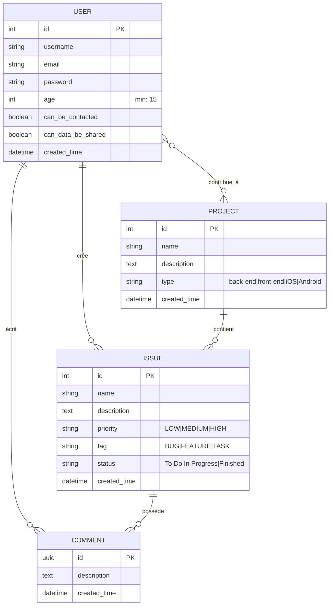

# Modèle Conceptuel de Données (MCD) - Application Issues Tracker

## Diagramme des entités et relations

## Description des relations

### User (Utilisateur)
- **Contribue à des projets** : Un utilisateur peut contribuer à plusieurs projets (N:M)
  - Cette relation a un attribut `created_time` pour enregistrer quand l'utilisateur est devenu contributeur
  - Note : L'auteur d'un projet est identifié comme le premier contributeur ajouté lors de la création
- **Crée des issues** : Un utilisateur peut créer plusieurs issues (1:N)
- **Écrit des commentaires** : Un utilisateur peut écrire plusieurs commentaires (1:N)
- **Champs RGPD** :
  - `age` : L'utilisateur doit avoir au moins 15 ans (validation RGPD)
  - `can_be_contacted` : Consentement pour être contacté
  - `can_data_be_shared` : Consentement pour le partage de données

### Project (Projet)
- **Auteur** : Chaque projet a un seul auteur (N:1 avec User)
- **Contributeurs** : Un projet peut avoir plusieurs contributeurs via la relation "contribue" (N:M avec User)
- **Issues** : Un projet peut contenir plusieurs issues (1:N)

### Relation "Contribue"
- Relation N:M entre User et Project
- Possède un attribut `created_time` pour tracer la date d'ajout du contributeur
- Contrainte : Un utilisateur ne peut contribuer qu'une fois à un même projet
- L'auteur du projet est automatiquement ajouté comme contributeur

### Issue (Problème/Tâche)
- **Projet** : Chaque issue appartient à un seul projet (N:1)
- **Auteur** : Chaque issue a un seul auteur (N:1 avec User)
- **Commentaires** : Une issue peut avoir plusieurs commentaires (1:N)
- **Note** : L'assignation d'une issue à un utilisateur est gérée via un attribut dans l'entité Issue

### Comment (Commentaire)
- **Issue** : Chaque commentaire appartient à une seule issue (N:1)
- **Auteur** : Chaque commentaire a un seul auteur (N:1 avec User)
- Utilise un UUID comme clé primaire

## Règles métier importantes

1. **Création de projet** : Quand un utilisateur crée un projet, il devient automatiquement contributeur
2. **Unicité contribue
1. **Création de projet** : Quand un utilisateur crée un projet, il devient automatiquement contributeur
2. **Unicité contributeur** : Un utilisateur ne peut être contributeur qu'une seule fois par projet
3. **Accès au projet** : Seuls l'auteur et les contributeurs peuvent accéder au projet
4. **Modification du projet** : Seul l'auteur peut modifier le projet
5. **Assignation d'issue** : Une issue peut être assignée uniquement à un contributeur du projet
5. **Assignation d'issue** : Une issue peut être assignée uniquement à un contributeur du projet
