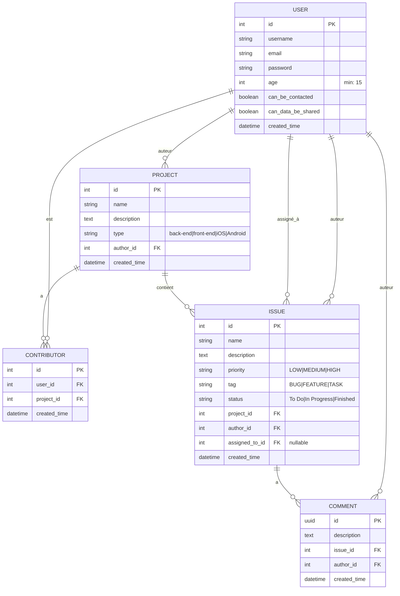

# Modèle Conceptuel de Données (MCD) - Application Issues Tracker

## Diagramme des entités et relations

## Description des relations

### User (Utilisateur)
- **Auteur de projets** : Un utilisateur peut créer plusieurs projets (1:N)
- **Contributeur** : Un utilisateur peut être contributeur sur plusieurs projets via la table Contributor (1:N)
- **Auteur d'issues** : Un utilisateur peut créer plusieurs issues (1:N)
- **Assigné à des issues** : Un utilisateur peut être assigné à plusieurs issues (1:N, nullable)
- **Auteur de commentaires** : Un utilisateur peut écrire plusieurs commentaires (1:N)
- **Champs RGPD** :
  - `age` : L'utilisateur doit avoir au moins 15 ans (validation RGPD)
  - `can_be_contacted` : Consentement pour être contacté
  - `can_data_be_shared` : Consentement pour le partage de données

### Project (Projet)
- **Auteur** : Chaque projet a un seul auteur (N:1 avec User) - relation directe via author_id
- **Contributeurs** : Un projet peut avoir plusieurs contributeurs via la table Contributor (1:N)
- **Issues** : Un projet peut contenir plusieurs issues (1:N)

### Contributor (Contributeur)
- Table d'association entre User et Project avec attributs supplémentaires
- **user_id** : Référence vers l'utilisateur contributeur
- **project_id** : Référence vers le projet
- **created_time** : Date d'ajout du contributeur
- Contrainte d'unicité sur (user_id, project_id)
- L'auteur du projet est automatiquement ajouté comme contributeur lors de la création

### Issue (Problème/Tâche)
- **Projet** : Chaque issue appartient à un seul projet (N:1)
- **Auteur** : Chaque issue a un seul auteur (N:1 avec User)
- **Assigné à** : Une issue peut être assignée à un utilisateur (N:1 avec User, nullable)
- **Commentaires** : Une issue peut avoir plusieurs commentaires (1:N)
- **Note** : L'assignation d'une issue à un utilisateur est gérée via un attribut dans l'entité Issue

### Comment (Commentaire)
- **Issue** : Chaque commentaire appartient à une seule issue (N:1)
- **Auteur** : Chaque commentaire a un seul auteur (N:1 avec User)
- Utilise un UUID comme clé primaire

## Règles métier importantes

1. **Création de projet** : Quand un utilisateur crée un projet, il devient automatiquement contributeur
2. **Unicité contributeur** : Un utilisateur ne peut être contributeur qu'une seule fois par projet
3. **Accès au projet** : Seuls l'auteur et les contributeurs peuvent accéder au projet
4. **Modification du projet** : Seul l'auteur peut modifier le projet
5. **Assignation d'issue** : Une issue peut être assignée uniquement à un contributeur du projet
