# 📊 Modèle Conceptuel de Données (MCD) - Application Issues Tracker

[← Retour à la documentation](../README.md) | [Architecture](./architecture.md)

## 📋 Navigation
- [Diagramme des entités](#diagramme-des-entités-et-relations)
- [Description des relations](#description-des-relations)
- [Règles métier](#règles-métier-importantes)
- [Implémentation Django](../guides/django-guide.md#les-modèles-django-orm)

## Diagramme des entités et relations

```mermaid
erDiagram
    USER ||--o{ PROJECT : "auteur"
    USER ||--o{ CONTRIBUTOR : "est"
    USER ||--o{ ISSUE : "auteur"
    USER ||--o{ COMMENT : "auteur"
    USER ||--o{ ISSUE : "assigné_à"
    
    PROJECT ||--o{ CONTRIBUTOR : "a"
    PROJECT ||--o{ ISSUE : "contient"
    
    ISSUE ||--o{ COMMENT : "a"
    
    USER {
        int id PK
        string username
        string email
        string password
        int age "min: 15"
        boolean can_be_contacted
        boolean can_data_be_shared
        datetime created_time
    }
    
    PROJECT {
        int id PK
        string name
        text description
        string type "back-end|front-end|iOS|Android"
        int author_id FK
        datetime created_time
    }
    
    CONTRIBUTOR {
        int id PK
        int user_id FK
        int project_id FK
        datetime created_time
    }
    
    ISSUE {
        int id PK
        string name
        text description
        string priority "LOW|MEDIUM|HIGH"
        string tag "BUG|FEATURE|TASK"
        string status "To Do|In Progress|Finished"
        int project_id FK
        int author_id FK
        int assigned_to_id FK "nullable"
        datetime created_time
    }
    
    COMMENT {
        uuid id PK
        text description
        int issue_id FK
        int author_id FK
        datetime created_time
    }
```

## Description des relations

### User (Utilisateur)
- **Auteur de projets** : Un utilisateur peut créer plusieurs projets (1:N)
- **Contributeur** : Un utilisateur peut être contributeur sur plusieurs projets via la table Contributor (1:N)
- **Auteur d'issues** : Un utilisateur peut créer plusieurs issues (1:N)
- **Assigné à des issues** : Un utilisateur peut être assigné à plusieurs issues (1:N, nullable)
- **Auteur de commentaires** : Un utilisateur peut écrire plusieurs commentaires (1:N)
- **Champs RGPD** :
  - `age` : L'utilisateur doit avoir au moins 15 ans (validation RGPD)
  - `can_be_contacted` : Consentement pour être contacté
  - `can_data_be_shared` : Consentement pour le partage de données

### Project (Projet)
- **Auteur** : Chaque projet a un seul auteur (N:1 avec User) - relation directe via author_id
- **Contributeurs** : Un projet peut avoir plusieurs contributeurs via la table Contributor (1:N)
- **Issues** : Un projet peut contenir plusieurs issues (1:N)

### Contributor (Contributeur)
- Table d'association entre User et Project avec attributs supplémentaires
- **user_id** : Référence vers l'utilisateur contributeur
- **project_id** : Référence vers le projet
- **created_time** : Date d'ajout du contributeur
- Contrainte d'unicité sur (user_id, project_id)
- L'auteur du projet est automatiquement ajouté comme contributeur lors de la création

### Issue (Problème/Tâche)
- **Projet** : Chaque issue appartient à un seul projet (N:1)
- **Auteur** : Chaque issue a un seul auteur (N:1 avec User)
- **Assigné à** : Une issue peut être assignée à un utilisateur (N:1 avec User, nullable)
- **Commentaires** : Une issue peut avoir plusieurs commentaires (1:N)
- **Note** : L'assignation d'une issue à un utilisateur est gérée via un attribut dans l'entité Issue

### Comment (Commentaire)
- **Issue** : Chaque commentaire appartient à une seule issue (N:1)
- **Auteur** : Chaque commentaire a un seul auteur (N:1 avec User)
- Utilise un UUID comme clé primaire

## Règles métier importantes

1. **Création de projet** : Quand un utilisateur crée un projet, il devient automatiquement contributeur
2. **Unicité contributeur** : Un utilisateur ne peut pas être contributeur plusieurs fois au même projet
3. **Suppression de projet** : La suppression d'un projet supprime également toutes les issues et commentaires associés
4. **Gestion des issues** :
   - Une issue doit avoir un titre, une description, et être liée à un projet
   - Une issue peut être assignée à un utilisateur ou être laissée non assignée
   - Les issues peuvent être triées par priorité, statut, et date de création
5. **Commentaires** : Chaque commentaire doit être lié à une issue et à un auteur

## Notes techniques

- Utilisation de UUID pour les identifiants de commentaires pour éviter les collisions
- Les mots de passe doivent être stockés de manière sécurisée (hashage)
- Mise en place de validations au niveau de l'application et de la base de données pour garantir l'intégrité des données
- Prévoir des index sur les colonnes fréquemment utilisées dans les requêtes (ex: user_id, project_id, issue_id)
