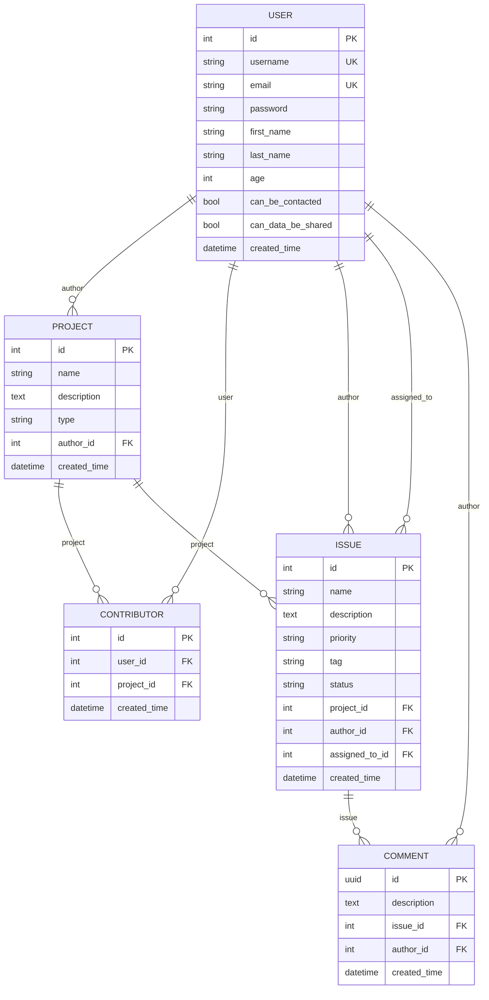

# 📊 Modèles de Données

[← Retour à l'architecture](./README.md)

## 🗄️ Diagramme des relations



## 📋 Description des modèles

### User (Utilisateur)
- **Hérite de** : AbstractUser Django
- **Champs RGPD** : age, can_be_contacted, can_data_be_shared
- **Relations** : Auteur de projets, issues et commentaires

### Project (Projet)
- **Types** : back-end, front-end, iOS, Android
- **Relations** : 
  - Un auteur (User)
  - Plusieurs contributeurs via Contributor
  - Plusieurs issues

### Contributor (Contributeur)
- **Table de liaison** : User ↔ Project
- **Contrainte unique** : (user, project)
- **Auto-création** : L'auteur devient contributeur automatiquement

### Issue (Problème/Tâche)
- **Priorités** : LOW, MEDIUM, HIGH
- **Tags** : BUG, FEATURE, TASK
- **Statuts** : To Do, In Progress, Finished
- **Relations** :
  - Appartient à un projet
  - Créée par un auteur
  - Peut être assignée à un contributeur

### Comment (Commentaire)
- **Clé primaire** : UUID pour meilleure distribution
- **Relations** : 
  - Appartient à une issue
  - Créé par un auteur

## 🔐 Contraintes et validations

### Contraintes de base de données
```python
# Unicité utilisateur-projet pour Contributor
UniqueConstraint(fields=['user', 'project'])

# Cascade deletions
on_delete=models.CASCADE  # Suppression en cascade
on_delete=models.SET_NULL  # Mise à NULL (assigned_to)
```

### Validations métier
1. **Project.type** : Doit être dans PROJECT_TYPES
2. **User.age** : Minimum 15 ans (RGPD)
3. **Issue.assigned_to** : Doit être contributeur du projet
4. **Contributor** : Pas de doublons user-project

## 🚀 Optimisations

1. **Index automatiques** sur toutes les ForeignKey
2. **UUID pour Comment** : Meilleure distribution en DB
3. **select_related/prefetch_related** : Dans les ViewSets
4. **Constraints au niveau DB** : Intégrité garantie
